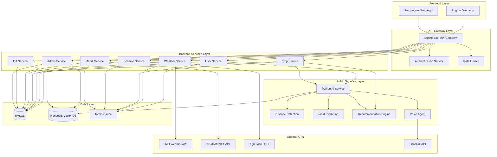

# Design Document: Indian Farmer Assistance Application

## Overview

The Indian Farmer Assistance Application is a comprehensive, multilingual, mobile-first platform built on a microservices architecture. The system integrates with multiple government Digital Public Infrastructure (DPI) services including IMD (India Meteorological Department), AGMARKNET (Agricultural Marketing Information Network), AgriStack (Farmer Registry, Geo-Referenced Village Map Registry, Crop Sown Registry), and Bhashini (National Language Translation Mission) to provide farmers with real-time agricultural intelligence, personalized recommendations, and seamless access to government schemes.

The application serves as a unified platform for farmers to access weather forecasts, crop recommendations, crop rotation planning, government scheme information, mandi prices, disease detection, IoT device management, and multilingual voice assistance—all optimized for low-end devices and low-bandwidth rural networks.

### Design Principles

1. **Mobile-First**: Optimized for low-end Android devices with 2GB RAM, with 3-second launch time target
2. **Offline-First**: Critical features (weather cache, scheme information, crop recommendations) work without connectivity
3. **Low-Bandwidth Optimized**: Compressed data transfers, adaptive quality reduction, optimized audio codecs for rural networks
4. **Multilingual**: Support for 22+ Indian languages via Bhashini API (ASR, NMT, TTS, OCR)
5. **DPI-Native**: Deep integration with AgriStack UFSI, Bhashini, IMD, and AGMARKNET APIs
6. **Privacy-by-Design**: DPDP Act 2023 compliant with data localization in India, AES-256 encryption at rest, TLS 1.3 in transit
7. **Scalable**: Horizontal scaling to support 1M+ concurrent users with 99.5% uptime target
8. **Audit-Ready**: Complete data provenance and audit trails for government compliance and AI-generated recommendations

## Architecture

### High-Level Architecture



### Microservices Architecture

The application follows a microservices pattern with the following services:

1. **API Gateway Service** (Spring Boot/Java)
   - Request routing and load balancing
   - Authentication and authorization
   - Rate limiting and throttling
   - Request/response transformation

2. **User Service** (Spring Boot/Java)
   - User registration and authentication
   - Profile management
   - AgriStack integration
   - Session management

3. **Weather Service** (Spring Boot/Java)
   - IMD API integration
   - Weather data caching
   - District-level alerts
   - Nowcast processing

4. **Crop Service** (Spring Boot/Java)
   - Crop recommendations
   - Rotation planning
   - GAEZ v4 integration
   - Soil health integration

5. **Scheme Service** (Spring Boot/Java)
   - Scheme catalog management
   - Eligibility assessment
   - Application tracking
   - State-specific filtering

6. **Mandi Service** (Spring Boot/Java)
   - AGMARKNET integration
   - Price trend analysis
   - Mandi location services
   - Price alerts

7. **IoT Service** (Spring Boot/Java)
   - Device provisioning
   - Sensor data collection
   - Threshold monitoring
   - Alert generation

8. **Admin Service** (Spring Boot/Java)
   - Document management
   - Scheme administration
   - User analytics
   - System configuration

9. **AI/ML Service** (Python)
   - Disease detection model
   - Yield prediction model
   - Recommendation engine
   - Vector embedding generation
   - Voice agent orchestration

## Components and Interfaces

### Frontend Components (Angular)

#### 1. Authentication Module
- Login/Registration components
- AgriStack UFSI integration
- Session management
- Offline authentication

#### 2. Dashboard Module
- Farmer profile display with personal details and Farmer ID
- Current crops overview with growth stages
- Upcoming activities (sowing, fertilizer application, harvest)
- Financial summary (input costs vs revenue)
- Quick actions (add crop, record harvest, check weather)
- Yield predictions and variance tracking
- Fertilizer usage summary and cost trends

#### 3. Weather Module
- 7-day forecast display
- Nowcast alerts
- District warnings
- Agromet advisories
- Offline weather cache

#### 4. Crop Module
- Crop recommendations with suitability scores
- Rotation planner with nutrient cycling optimization
- Yield estimator with min/expected/max ranges
- Fertilizer calculator with split application schedules
- Crop history tracker (5 years or 10 cycles)
- Harvest recording with quality grades
- Input cost tracking (seeds, fertilizers, pesticides, labor)
- Livestock management (cattle, poultry, goats)
- Equipment tracking (tractors, harvesters, pump sets)

#### 5. Scheme Module
- Scheme browser with central and state-specific schemes
- Eligibility checker with confidence indicators
- Personalized scheme recommendations ranked by benefit
- Application tracker with status updates
- Deadline notifications (7 days and 1 day before)
- Document upload for applications
- State-specific scheme filtering (Karnataka, Maharashtra, Telangana, Andhra Pradesh, Haryana, Uttar Pradesh, Punjab)
- PM-Kisan, PMFBY, KCC, and state scheme details

#### 6. Mandi Module
- Price search
- Trend visualization
- Mandi locator
- Price alerts
- MSP comparison

#### 7. Voice Agent Module
- Voice input interface
- Language selector
- Conversation history
- Text fallback
- Audio playback

#### 8. Disease Detection Module
- Image capture/upload
- Disease identification
- Treatment recommendations
- KVK expert links
- Detection history

#### 9. IoT Module
- Device management
- Sensor dashboard
- Alert configuration
- Historical trends
- Device provisioning

#### 10. Admin Module
- Document upload
- Scheme management
- User analytics
- System configuration
- Audit logs

### Backend Service Interfaces

#### User Service API

```
POST   /api/v1/users/register
POST   /api/v1/users/login
GET    /api/v1/users/profile
PUT    /api/v1/users/profile
POST   /api/v1/users/agristack/sync
GET    /api/v1/users/profile/crops
POST   /api/v1/users/profile/crops
PUT    /api/v1/users/profile/crops/{id}
DELETE /api/v1/users/profile/crops/{id}
GET    /api/v1/users/profile/harvest/{cropId}
POST   /api/v1/users/profile/harvest
GET    /api/v1/users/profile/fertilizer
POST   /api/v1/users/profile/fertilizer
GET    /api/v1/users/profile/equipment
POST   /api/v1/users/profile/equipment
GET    /api/v1/users/profile/livestock
POST   /api/v1/users/profile/livestock
GET    /api/v1/users/profile/history
GET    /api/v1/users/profile/dashboard
```

#### Weather Service API

```
GET    /api/v1/weather/forecast/{district}
GET    /api/v1/weather/current/{district}
GET    /api/v1/weather/nowcast/{district}
GET    /api/v1/weather/alerts/{district}
GET    /api/v1/weather/rainfall/{district}
GET    /api/v1/weather/agromet/{district}
```

#### Crop Service API

```
GET    /api/v1/crops/recommendations
POST   /api/v1/crops/recommendations/calculate
GET    /api/v1/crops/rotation/{farmerId}
POST   /api/v1/crops/rotation/generate
GET    /api/v1/crops/varieties/{cropName}
GET    /api/v1/crops/suitability/{location}
POST   /api/v1/crops/yield/estimate
GET    /api/v1/crops/yield/history/{cropId}
POST   /api/v1/crops/yield/actual
GET    /api/v1/crops/fertilizer/recommend
POST   /api/v1/crops/fertilizer/calculate
GET    /api/v1/crops/fertilizer/history/{cropId}
```

#### Scheme Service API

```
GET    /api/v1/schemes
GET    /api/v1/schemes/{id}
GET    /api/v1/schemes/crop/{cropName}
GET    /api/v1/schemes/state/{state}
POST   /api/v1/schemes/eligibility/check
GET    /api/v1/schemes/personalized/{farmerId}
POST   /api/v1/schemes/applications
GET    /api/v1/schemes/applications/{farmerId}
PUT    /api/v1/schemes/applications/{id}/status
```

#### Mandi Service API

```
GET    /api/v1/mandi/prices/{commodity}
GET    /api/v1/mandi/prices/nearby
GET    /api/v1/mandi/prices/trends/{commodity}
GET    /api/v1/mandi/prices/msp/{commodity}
GET    /api/v1/mandi/locations/nearby
POST   /api/v1/mandi/alerts/subscribe
GET    /api/v1/mandi/alerts/{farmerId}
```

#### IoT Service API

```
GET    /api/v1/iot/devices/{farmerId}
POST   /api/v1/iot/devices/provision
PUT    /api/v1/iot/devices/{deviceId}/config
DELETE /api/v1/iot/devices/{deviceId}
GET    /api/v1/iot/devices/{deviceId}/readings
GET    /api/v1/iot/devices/{deviceId}/readings/history
POST   /api/v1/iot/devices/{deviceId}/alerts/config
GET    /api/v1/iot/devices/{deviceId}/alerts
```

#### AI/ML Service API (Python)

```
POST   /api/v1/ai/disease/detect
POST   /api/v1/ai/yield/predict
POST   /api/v1/ai/yield/update-model
POST   /api/v1/ai/recommendations/generate
POST   /api/v1/ai/fertilizer/recommend
POST   /api/v1/ai/fertilizer/calculate-nutrients
POST   /api/v1/ai/voice/process
POST   /api/v1/ai/voice/asr
POST   /api/v1/ai/voice/tts
POST   /api/v1/ai/voice/translate
POST   /api/v1/ai/embeddings/generate
POST   /api/v1/ai/search/semantic
POST   /api/v1/ai/ocr/extract
```

#### Admin Service API

```
POST   /api/v1/admin/documents/upload
GET    /api/v1/admin/documents
PUT    /api/v1/admin/documents/{id}
DELETE /api/v1/admin/documents/{id}
POST   /api/v1/admin/schemes
PUT    /api/v1/admin/schemes/{id}
DELETE /api/v1/admin/schemes/{id}
GET    /api/v1/admin/analytics/users
GET    /api/v1/admin/analytics/usage
GET    /api/v1/admin/audit/logs
```

## Data Models

### MySQL Database Schema

#### Users Table
```sql
CREATE TABLE users (
    id BIGINT PRIMARY KEY AUTO_INCREMENT,
    farmer_id VARCHAR(50) UNIQUE NOT NULL,
    aadhaar_hash VARCHAR(64) NOT NULL,
    name VARCHAR(100) NOT NULL,
    phone VARCHAR(15) UNIQUE NOT NULL,
    email VARCHAR(100),
    preferred_language VARCHAR(10) DEFAULT 'en',
    state VARCHAR(50) NOT NULL,
    district VARCHAR(50) NOT NULL,
    village VARCHAR(100),
    pin_code VARCHAR(10),
    gps_latitude DECIMAL(10, 8),
    gps_longitude DECIMAL(11, 8),
    role ENUM('FARMER', 'ADMIN') DEFAULT 'FARMER',
    created_at TIMESTAMP DEFAULT CURRENT_TIMESTAMP,
    updated_at TIMESTAMP DEFAULT CURRENT_TIMESTAMP ON UPDATE CURRENT_TIMESTAMP,
    last_login TIMESTAMP,
    is_active BOOLEAN DEFAULT TRUE,
    INDEX idx_farmer_id (farmer_id),
    INDEX idx_phone (phone),
    INDEX idx_location (state, district)
);
```

#### Farms Table
```sql
CREATE TABLE farms (
    id BIGINT PRIMARY KEY AUTO_INCREMENT,
    user_id BIGINT NOT NULL,
    parcel_number VARCHAR(50),
    total_area_acres DECIMAL(10, 2) NOT NULL,
    soil_type VARCHAR(50),
    irrigation_type ENUM('RAINFED', 'DRIP', 'SPRINKLER', 'CANAL', 'BOREWELL'),
    agro_ecological_zone VARCHAR(100),
    survey_number VARCHAR(50),
    gps_latitude DECIMAL(10, 8),
    gps_longitude DECIMAL(11, 8),
    created_at TIMESTAMP DEFAULT CURRENT_TIMESTAMP,
    updated_at TIMESTAMP DEFAULT CURRENT_TIMESTAMP ON UPDATE CURRENT_TIMESTAMP,
    FOREIGN KEY (user_id) REFERENCES users(id) ON DELETE CASCADE,
    INDEX idx_user_id (user_id)
);
```

#### Crops Table
```sql
CREATE TABLE crops (
    id BIGINT PRIMARY KEY AUTO_INCREMENT,
    farm_id BIGINT NOT NULL,
    crop_name VARCHAR(100) NOT NULL,
    crop_variety VARCHAR(100),
    sowing_date DATE NOT NULL,
    expected_harvest_date DATE,
    actual_harvest_date DATE,
    area_acres DECIMAL(10, 2) NOT NULL,
    season ENUM('KHARIF', 'RABI', 'ZAID'),
    status ENUM('SOWN', 'GROWING', 'HARVESTED', 'FAILED') DEFAULT 'SOWN',
    seed_cost DECIMAL(10, 2),
    fertilizer_cost DECIMAL(10, 2),
    pesticide_cost DECIMAL(10, 2),
    labor_cost DECIMAL(10, 2),
    other_cost DECIMAL(10, 2),
    total_yield_quintals DECIMAL(10, 2),
    quality_grade VARCHAR(20),
    selling_price_per_quintal DECIMAL(10, 2),
    mandi_name VARCHAR(100),
    created_at TIMESTAMP DEFAULT CURRENT_TIMESTAMP,
    updated_at TIMESTAMP DEFAULT CURRENT_TIMESTAMP ON UPDATE CURRENT_TIMESTAMP,
    FOREIGN KEY (farm_id) REFERENCES farms(id) ON DELETE CASCADE,
    INDEX idx_farm_id (farm_id),
    INDEX idx_crop_name (crop_name),
    INDEX idx_season (season),
    INDEX idx_status (status)
);
```

#### Fertilizer_Applications Table
```sql
CREATE TABLE fertilizer_applications (
    id BIGINT PRIMARY KEY AUTO_INCREMENT,
    crop_id BIGINT NOT NULL,
    fertilizer_type VARCHAR(100) NOT NULL,
    fertilizer_category ENUM('CHEMICAL', 'ORGANIC', 'BIO'),
    quantity_kg DECIMAL(10, 2) NOT NULL,
    application_date DATE NOT NULL,
    application_stage VARCHAR(50),
    cost DECIMAL(10, 2),
    nitrogen_content_percent DECIMAL(5, 2),
    phosphorus_content_percent DECIMAL(5, 2),
    potassium_content_percent DECIMAL(5, 2),
    created_at TIMESTAMP DEFAULT CURRENT_TIMESTAMP,
    FOREIGN KEY (crop_id) REFERENCES crops(id) ON DELETE CASCADE,
    INDEX idx_crop_id (crop_id),
    INDEX idx_application_date (application_date)
);
```

#### Livestock Table
```sql
CREATE TABLE livestock (
    id BIGINT PRIMARY KEY AUTO_INCREMENT,
    user_id BIGINT NOT NULL,
    farm_id BIGINT,
    livestock_type ENUM('CATTLE', 'BUFFALO', 'GOAT', 'SHEEP', 'POULTRY', 'OTHER'),
    breed VARCHAR(100),
    quantity INT NOT NULL,
    purpose ENUM('DAIRY', 'MEAT', 'EGGS', 'DRAFT', 'BREEDING'),
    acquisition_date DATE,
    notes TEXT,
    created_at TIMESTAMP DEFAULT CURRENT_TIMESTAMP,
    updated_at TIMESTAMP DEFAULT CURRENT_TIMESTAMP ON UPDATE CURRENT_TIMESTAMP,
    FOREIGN KEY (user_id) REFERENCES users(id) ON DELETE CASCADE,
    FOREIGN KEY (farm_id) REFERENCES farms(id) ON DELETE SET NULL,
    INDEX idx_user_id (user_id),
    INDEX idx_livestock_type (livestock_type)
);
```

#### Equipment Table
```sql
CREATE TABLE equipment (
    id BIGINT PRIMARY KEY AUTO_INCREMENT,
    user_id BIGINT NOT NULL,
    equipment_type VARCHAR(100) NOT NULL,
    equipment_name VARCHAR(200),
    manufacturer VARCHAR(100),
    model VARCHAR(100),
    purchase_date DATE,
    purchase_cost DECIMAL(12, 2),
    ownership_type ENUM('OWNED', 'LEASED', 'SHARED'),
    last_maintenance_date DATE,
    next_maintenance_date DATE,
    notes TEXT,
    created_at TIMESTAMP DEFAULT CURRENT_TIMESTAMP,
    updated_at TIMESTAMP DEFAULT CURRENT_TIMESTAMP ON UPDATE CURRENT_TIMESTAMP,
    FOREIGN KEY (user_id) REFERENCES users(id) ON DELETE CASCADE,
    INDEX idx_user_id (user_id),
    INDEX idx_equipment_type (equipment_type)
);
```

#### Yield_Predictions Table
```sql
CREATE TABLE yield_predictions (
    id BIGINT PRIMARY KEY AUTO_INCREMENT,
    crop_id BIGINT NOT NULL,
    prediction_date DATE NOT NULL,
    predicted_yield_min_quintals DECIMAL(10, 2) NOT NULL,
    predicted_yield_expected_quintals DECIMAL(10, 2) NOT NULL,
    predicted_yield_max_quintals DECIMAL(10, 2) NOT NULL,
    confidence_interval_percent DECIMAL(5, 2),
    factors_considered JSON,
    model_version VARCHAR(50),
    actual_yield_quintals DECIMAL(10, 2),
    variance_quintals DECIMAL(10, 2),
    variance_percent DECIMAL(5, 2),
    created_at TIMESTAMP DEFAULT CURRENT_TIMESTAMP,
    updated_at TIMESTAMP DEFAULT CURRENT_TIMESTAMP ON UPDATE CURRENT_TIMESTAMP,
    FOREIGN KEY (crop_id) REFERENCES crops(id) ON DELETE CASCADE,
    INDEX idx_crop_id (crop_id),
    INDEX idx_prediction_date (prediction_date)
);
```

#### Schemes Table
```sql
CREATE TABLE schemes (
    id BIGINT PRIMARY KEY AUTO_INCREMENT,
    scheme_code VARCHAR(50) UNIQUE NOT NULL,
    scheme_name VARCHAR(200) NOT NULL,
    scheme_type ENUM('CENTRAL', 'STATE', 'CROP_SPECIFIC', 'INSURANCE', 'SUBSIDY', 'WELFARE'),
    state VARCHAR(50),
    description TEXT,
    eligibility_criteria JSON,
    benefit_amount DECIMAL(12, 2),
    benefit_description TEXT,
    application_start_date DATE,
    application_end_date DATE,
    application_url VARCHAR(500),
    contact_info JSON,
    is_active BOOLEAN DEFAULT TRUE,
    created_at TIMESTAMP DEFAULT CURRENT_TIMESTAMP,
    updated_at TIMESTAMP DEFAULT CURRENT_TIMESTAMP ON UPDATE CURRENT_TIMESTAMP,
    INDEX idx_scheme_type (scheme_type),
    INDEX idx_state (state),
    INDEX idx_active (is_active)
);
```

#### Scheme_Applications Table
```sql
CREATE TABLE scheme_applications (
    id BIGINT PRIMARY KEY AUTO_INCREMENT,
    user_id BIGINT NOT NULL,
    scheme_id BIGINT NOT NULL,
    application_date DATE NOT NULL,
    application_number VARCHAR(100),
    status ENUM('DRAFT', 'SUBMITTED', 'UNDER_REVIEW', 'APPROVED', 'REJECTED', 'DISBURSED') DEFAULT 'DRAFT',
    documents JSON,
    remarks TEXT,
    created_at TIMESTAMP DEFAULT CURRENT_TIMESTAMP,
    updated_at TIMESTAMP DEFAULT CURRENT_TIMESTAMP ON UPDATE CURRENT_TIMESTAMP,
    FOREIGN KEY (user_id) REFERENCES users(id) ON DELETE CASCADE,
    FOREIGN KEY (scheme_id) REFERENCES schemes(id) ON DELETE CASCADE,
    INDEX idx_user_id (user_id),
    INDEX idx_scheme_id (scheme_id),
    INDEX idx_status (status)
);
```

#### Mandi_Prices Table
```sql
CREATE TABLE mandi_prices (
    id BIGINT PRIMARY KEY AUTO_INCREMENT,
    commodity_name VARCHAR(100) NOT NULL,
    variety VARCHAR(100),
    mandi_name VARCHAR(100) NOT NULL,
    mandi_code VARCHAR(50),
    state VARCHAR(50) NOT NULL,
    district VARCHAR(50) NOT NULL,
    price_date DATE NOT NULL,
    modal_price DECIMAL(10, 2),
    min_price DECIMAL(10, 2),
    max_price DECIMAL(10, 2),
    arrival_quantity_quintals DECIMAL(12, 2),
    unit VARCHAR(20) DEFAULT 'Quintal',
    source VARCHAR(50) DEFAULT 'AGMARKNET',
    created_at TIMESTAMP DEFAULT CURRENT_TIMESTAMP,
    INDEX idx_commodity (commodity_name),
    INDEX idx_mandi (mandi_name),
    INDEX idx_location (state, district),
    INDEX idx_date (price_date),
    UNIQUE KEY unique_price_record (commodity_name, variety, mandi_code, price_date)
);
```

#### IoT_Devices Table
```sql
CREATE TABLE iot_devices (
    id BIGINT PRIMARY KEY AUTO_INCREMENT,
    user_id BIGINT NOT NULL,
    farm_id BIGINT,
    device_id VARCHAR(100) UNIQUE NOT NULL,
    device_name VARCHAR(100) NOT NULL,
    device_type VARCHAR(50),
    manufacturer VARCHAR(100),
    model VARCHAR(100),
    firmware_version VARCHAR(50),
    status ENUM('ACTIVE', 'INACTIVE', 'MAINTENANCE', 'OFFLINE') DEFAULT 'ACTIVE',
    last_seen TIMESTAMP,
    configuration JSON,
    created_at TIMESTAMP DEFAULT CURRENT_TIMESTAMP,
    updated_at TIMESTAMP DEFAULT CURRENT_TIMESTAMP ON UPDATE CURRENT_TIMESTAMP,
    FOREIGN KEY (user_id) REFERENCES users(id) ON DELETE CASCADE,
    FOREIGN KEY (farm_id) REFERENCES farms(id) ON DELETE SET NULL,
    INDEX idx_user_id (user_id),
    INDEX idx_device_id (device_id),
    INDEX idx_status (status)
);
```

#### Sensor_Readings Table
```sql
CREATE TABLE sensor_readings (
    id BIGINT PRIMARY KEY AUTO_INCREMENT,
    device_id BIGINT NOT NULL,
    reading_timestamp TIMESTAMP NOT NULL,
    soil_moisture_percent DECIMAL(5, 2),
    temperature_celsius DECIMAL(5, 2),
    humidity_percent DECIMAL(5, 2),
    ph_level DECIMAL(4, 2),
    ec_value DECIMAL(6, 2),
    npk_nitrogen DECIMAL(6, 2),
    npk_phosphorus DECIMAL(6, 2),
    npk_potassium DECIMAL(6, 2),
    created_at TIMESTAMP DEFAULT CURRENT_TIMESTAMP,
    FOREIGN KEY (device_id) REFERENCES iot_devices(id) ON DELETE CASCADE,
    INDEX idx_device_timestamp (device_id, reading_timestamp),
    INDEX idx_timestamp (reading_timestamp)
);
```

#### Weather_Cache Table
```sql
CREATE TABLE weather_cache (
    id BIGINT PRIMARY KEY AUTO_INCREMENT,
    district VARCHAR(50) NOT NULL,
    state VARCHAR(50) NOT NULL,
    forecast_date DATE NOT NULL,
    max_temp_celsius DECIMAL(5, 2),
    min_temp_celsius DECIMAL(5, 2),
    humidity_0830 DECIMAL(5, 2),
    humidity_1730 DECIMAL(5, 2),
    rainfall_mm DECIMAL(6, 2),
    wind_speed_kmph DECIMAL(5, 2),
    wind_direction VARCHAR(10),
    cloud_coverage INT,
    sunrise_time TIME,
    sunset_time TIME,
    forecast_type ENUM('7DAY', 'NOWCAST', 'CURRENT'),
    source VARCHAR(50) DEFAULT 'IMD',
    fetched_at TIMESTAMP DEFAULT CURRENT_TIMESTAMP,
    INDEX idx_location_date (district, state, forecast_date),
    INDEX idx_fetched_at (fetched_at)
);
```

#### Disease_Detections Table
```sql
CREATE TABLE disease_detections (
    id BIGINT PRIMARY KEY AUTO_INCREMENT,
    user_id BIGINT NOT NULL,
    crop_id BIGINT,
    image_path VARCHAR(500) NOT NULL,
    disease_name VARCHAR(200),
    disease_name_local VARCHAR(200),
    confidence_score DECIMAL(5, 2),
    severity_level ENUM('LOW', 'MEDIUM', 'HIGH', 'CRITICAL'),
    affected_area_percent DECIMAL(5, 2),
    treatment_recommendations JSON,
    detection_timestamp TIMESTAMP DEFAULT CURRENT_TIMESTAMP,
    model_version VARCHAR(50),
    FOREIGN KEY (user_id) REFERENCES users(id) ON DELETE CASCADE,
    FOREIGN KEY (crop_id) REFERENCES crops(id) ON DELETE SET NULL,
    INDEX idx_user_id (user_id),
    INDEX idx_crop_id (crop_id),
    INDEX idx_timestamp (detection_timestamp)
);
```

#### Audit_Logs Table
```sql
CREATE TABLE audit_logs (
    id BIGINT PRIMARY KEY AUTO_INCREMENT,
    user_id BIGINT,
    action VARCHAR(100) NOT NULL,
    entity_type VARCHAR(50),
    entity_id BIGINT,
    old_value JSON,
    new_value JSON,
    ip_address VARCHAR(45),
    user_agent TEXT,
    timestamp TIMESTAMP DEFAULT CURRENT_TIMESTAMP,
    FOREIGN KEY (user_id) REFERENCES users(id) ON DELETE SET NULL,
    INDEX idx_user_id (user_id),
    INDEX idx_timestamp (timestamp),
    INDEX idx_entity (entity_type, entity_id)
);
```

### MongoDB Collections (Vector Database)

**Note**: The application uses MongoDB as the initial vector database implementation with a VectorStoreAdapter interface to abstract the underlying vector store. This design allows future migration to specialized vector stores (Milvus, Weaviate, Qdrant) without changing application code.

#### VectorStoreAdapter Interface
```typescript
interface VectorStoreAdapter {
  // Store document with embedding
  storeDocument(document: Document, embedding: number[]): Promise<string>;
  
  // Search by vector similarity
  searchBySimilarity(queryEmbedding: number[], limit: number, filters?: object): Promise<SearchResult[]>;
  
  // Update document and embedding
  updateDocument(documentId: string, document: Document, embedding: number[]): Promise<void>;
  
  // Delete document
  deleteDocument(documentId: string): Promise<void>;
  
  // Get document by ID
  getDocument(documentId: string): Promise<Document>;
}
```

#### Documents Collection
```javascript
{
  _id: ObjectId,
  document_id: String,
  title: String,
  category: String, // "schemes", "guidelines", "crop_info", "disease_mgmt", "market_intel"
  content: String,
  content_language: String,
  embedding: Array<Float>, // 768-dimensional vector
  metadata: {
    source: String,
    upload_date: Date,
    uploaded_by: String,
    version: Number,
    state: String,
    applicable_crops: Array<String>,
    tags: Array<String>
  },
  is_active: Boolean,
  created_at: Date,
  updated_at: Date
}
```

#### Voice_Conversations Collection
```javascript
{
  _id: ObjectId,
  user_id: String,
  session_id: String,
  language: String,
  conversations: [
    {
      timestamp: Date,
      user_audio_path: String,
      user_text: String,
      user_text_translated: String,
      system_response: String,
      system_response_translated: String,
      system_audio_path: String,
      intent: String,
      entities: Object,
      confidence: Float
    }
  ],
  created_at: Date,
  updated_at: Date
}
```

## Correctness Properties

*A property is a characteristic or behavior that should hold true across all valid executions of a system—essentially, a formal statement about what the system should do. Properties serve as the bridge between human-readable specifications and machine-verifiable correctness guarantees.*

### Property 1: API Parameter Correctness
*For any* farmer location (district, state), when requesting weather data from IMD API, the system should call the API with the correct district parameter matching the farmer's location.
**Validates: Requirements 1.1**

### Property 2: Weather Data Completeness
*For any* weather forecast response, all required fields (max temp, min temp, humidity at 0830 and 1730 hours, rainfall, wind speed, wind direction, cloud coverage, sunrise/sunset times, moonrise/moonset times) should be present for each of the 7 forecast days.
**Validates: Requirements 1.2**

### Property 3: Alert Display Consistency
*For any* weather response containing district-level warnings or nowcast alerts, the system should display all warnings with severity indicators, and no warnings should be displayed when none are present in the response.
**Validates: Requirements 1.4, 1.5**

### Property 4: Cached Data Timestamp Display
*For any* cached data (weather, schemes, prices) displayed in offline mode, the system should include a timestamp indicating when the data was last fetched, and the timestamp should accurately reflect the cache time.
**Validates: Requirements 1.9, 5.12, 6.11, 12.5**

### Property 5: Location to Zone Mapping Consistency
*For any* valid GPS coordinates within India, the system should consistently map the same coordinates to the same agro-ecological zone across multiple requests.
**Validates: Requirements 2.1**

### Property 6: Descending Ranking Order
*For any* list of items with numeric scores (crop suitability scores, rotation options ranked by benefit, disease detections ranked by confidence, scheme recommendations ranked by benefit amount, search results ranked by similarity), the displayed list should be sorted in descending order such that for any two adjacent items, the first has a score greater than or equal to the second.
**Validates: Requirements 2.5, 3.9, 9.7, 11D.3, 21.8**

### Property 7: Crop Recommendation Data Completeness
*For any* crop recommendation, all required fields (crop name, expected yield range, potential yield gap, water requirements, growing season duration, suitability score) should be present in the response.
**Validates: Requirements 2.6**

### Property 8: Nutrient Depletion Risk Detection
*For any* crop history sequence, if the same crop family is grown consecutively for 3 or more seasons, the system should flag a nutrient depletion risk for that crop family.
**Validates: Requirements 3.2**

### Property 9: Eligibility Assessment Consistency
*For any* farmer profile and government scheme, running the eligibility check multiple times with the same inputs should produce the same eligibility result (eligible/not eligible with the same confidence level).
**Validates: Requirements 4.4, 11D.1**

### Property 10: State-Based Scheme Filtering
*For any* farmer located in state S, all schemes returned should either be central schemes (applicable to all states) or state-specific schemes where the scheme's state matches S, and no schemes from other states should be included.
**Validates: Requirements 4.3, 5.3, 5.4, 5.5, 5.6, 5.7, 5.8, 5.9**

### Property 11: Distance-Based Ascending Sort
*For any* list of locations (mandis, government bodies, KVKs) sorted by distance from a farmer's location, for any two adjacent items in the list, the first should have a distance less than or equal to the second.
**Validates: Requirements 6.4, 7.2**

### Property 12: Price Data Completeness and Constraints
*For any* mandi price record, all required fields (modal price, min price, max price, arrival quantity in quintals, commodity variety) should be present, and the constraint min_price ≤ modal_price ≤ max_price should hold.
**Validates: Requirements 6.2**

### Property 13: Language Configuration Consistency
*For any* supported language selected by a farmer, the system should configure Bhashini API for that language, and all subsequent voice interactions should use that language configuration until changed.
**Validates: Requirements 8.1, 8.12**

### Property 14: Disambiguation Trigger
*For any* voice query that matches multiple intents with similar confidence scores (difference < 10%), the system should request disambiguation confirmation from the user before proceeding with any action.
**Validates: Requirements 8.7**

### Property 15: Voice Fallback Hierarchy
*For any* voice processing failure, the system should fall back to text input, and if text processing fails, it should fall back to cached answers, following the explicit hierarchy: voice → text → cached, and no other fallback order should be used.
**Validates: Requirements 8.9**

### Property 16: Image Validation
*For any* image uploaded for disease detection, the system should validate that the format is JPEG or PNG and the size is ≤ 10MB before processing, and reject any image that fails these criteria.
**Validates: Requirements 9.1**

### Property 17: Disease Detection Confidence Threshold
*For any* disease detection result, if the confidence score is below 70%, the system should not display a definitive disease name but should instead indicate that the crop appears healthy or request a clearer image.
**Validates: Requirements 9.8**

### Property 18: IoT Alert Threshold Monitoring
*For any* sensor reading where a measured value exceeds the configured threshold for that sensor type, the system should generate an alert, and no alert should be generated when all values are within their respective thresholds.
**Validates: Requirements 10.4**

### Property 19: End-to-End Encryption
*For any* data transmission (API calls, database writes, IoT data), the system should use TLS 1.3 or higher for data in transit and AES-256 for data at rest, and no sensitive data should be transmitted or stored in plaintext.
**Validates: Requirements 10.11, 17.1, 17.2**

### Property 20: AgriStack Profile Retrieval
*For any* successful farmer authentication via AgriStack UFSI, the system should retrieve the farmer's profile from all three core registries (Farmer Registry, Geo-Referenced Village Map Registry, Crop Sown Registry) and populate the local profile with this data.
**Validates: Requirements 11.3**

### Property 21: Profile Data Persistence Round Trip
*For any* farmer profile update (personal details, farm details, crop records, fertilizer applications, equipment), all required fields should be persisted to the database, and subsequent reads should return the same data that was written (round-trip property).
**Validates: Requirements 11A.4, 11A.6**

### Property 22: Data Retention Policy
*For any* crop record, if the record is less than 5 years old OR part of the most recent 10 crop cycles (whichever is longer), it should be retained in the system and accessible to the farmer.
**Validates: Requirements 11A.6**

### Property 23: Version History Maintenance
*For any* profile update or document update, the system should create a new version entry with timestamp and modifier information, and all previous versions should remain accessible for audit purposes.
**Validates: Requirements 11A.7, 21.6**

### Property 24: Yield Estimate Range Validity
*For any* yield estimate, the system should provide minimum, expected, and maximum values where minimum ≤ expected ≤ maximum, and confidence intervals should be included.
**Validates: Requirements 11B.7**

### Property 25: Prediction Variance Calculation
*For any* crop where both predicted yield and actual harvest data exist, the system should calculate and store the variance (actual - predicted) for use in improving future predictions.
**Validates: Requirements 11B.9**

### Property 26: Fertilizer Recommendation Completeness
*For any* fertilizer recommendation, all required fields (fertilizer type, quantity per acre, application timing, split application schedule with specific dates) should be present in the response.
**Validates: Requirements 11C.3, 11C.4**

### Property 27: Nutrient Calculation Accuracy
*For any* set of fertilizer applications for a crop cycle, the total nutrient input (N, P, K) should equal the sum of (quantity_kg × nutrient_content_percent / 100) across all applications for each nutrient type.
**Validates: Requirements 11C.7**

### Property 28: Scheme Deadline Notification Timing
*For any* scheme with an approaching application deadline, the system should send push notifications exactly 7 days before and 1 day before the deadline to eligible farmers.
**Validates: Requirements 11D.9**

### Property 29: Offline Mode Activation
*For any* network state change from connected to disconnected, the system should automatically enable offline mode and display an offline indicator to the user within 2 seconds of detecting the disconnection.
**Validates: Requirements 12.1**

### Property 30: Sync Queue FIFO Processing
*For any* set of queued requests created during offline mode, when connectivity is restored, the system should process all queued requests in the order they were created (FIFO), such that for any two requests R1 and R2 where R1 was created before R2, R1 should be processed before R2.
**Validates: Requirements 12.4**

### Property 31: Adaptive Quality Reduction
*For any* network bandwidth measurement below the configured threshold, the system should reduce image quality for all subsequent image transfers until bandwidth improves above the threshold.
**Validates: Requirements 13.1**

### Property 32: Reverse Geocoding Accuracy
*For any* GPS coordinates within India, the reverse geocoded location (district, state) should match the administrative boundaries as defined by the authoritative source, with a tolerance for boundary edge cases (within 1km of boundaries).
**Validates: Requirements 14.3**

### Property 33: Conflict Resolution by Timestamp
*For any* two conflicting updates to the same data field from different devices, the system should retain the update with the most recent timestamp and discard the older update.
**Validates: Requirements 15.3**

### Property 34: Localization Completeness
*For any* supported language, all UI text elements should have translations available, and no UI element should display text in a different language than the user's selected language.
**Validates: Requirements 16.3**

### Property 35: Error Message User-Friendliness
*For any* API failure or system error, the error message displayed to the user should be in the user's selected language, should not contain technical stack traces or error codes, and should suggest a remediation action.
**Validates: Requirements 19.1**

### Property 36: Retry Logic Bounds
*For any* failed network request, the system should retry exactly up to 3 times with exponential backoff (1s, 2s, 4s), and should not retry more than 3 times or retry indefinitely.
**Validates: Requirements 19.2**

### Property 37: PII Exclusion from Analytics
*For any* analytics event collected, the event data should not contain personally identifiable information (name, phone, email, Aadhaar, Farmer ID) unless the user has explicitly consented to PII collection.
**Validates: Requirements 20.5**

### Property 38: Document Format Validation
*For any* document uploaded by an admin, the system should validate that the format is PDF, DOCX, or TXT and the size is ≤ 50MB before processing, and reject any document that fails these criteria.
**Validates: Requirements 21.2**

### Property 39: Vector Embedding Generation
*For any* document uploaded by an admin that passes validation, the system should generate a vector embedding of the configured dimensionality (768 dimensions), and the embedding should be stored in the MongoDB vector database with appropriate indexing.
**Validates: Requirements 21.3, 21.4**

### Property 40: Semantic Search Ranking
*For any* search query, the returned documents should be ranked by cosine similarity to the query embedding in descending order, such that for any two adjacent documents in the results, the first has similarity ≥ the second.
**Validates: Requirements 21.8**

### Property 41: Role-Based Access Control
*For any* user with role "FARMER" attempting to access an admin-only endpoint, the system should return a 403 Forbidden response and log the unauthorized access attempt with timestamp and user information.
**Validates: Requirements 22.5**

### Property 42: Audit Log Completeness
*For any* administrative action (document upload, scheme creation/update/deletion, user role modification), the system should create an audit log entry containing timestamp, admin identifier, action type, entity type, entity ID, old value, and new value.
**Validates: Requirements 21.11, 22.7y* role modification, the system should create an audit log entry containing user_id, action, old_role, new_role, timestamp, and modifier_id.
**Validates: Requirements 22.2**

## Error Handling

### Error Categories and Handling Strategies

#### 1. External API Failures

**IMD Weather API Failures**
- **Timeout**: Retry up to 3 times with exponential backoff (1s, 2s, 4s)
- **Rate Limit**: Queue request and retry after rate limit window
- **Invalid Response**: Fall back to cached weather data
- **Service Unavailable**: Display cached data with staleness indicator

**AGMARKNET API Failures**
- **Timeout**: Retry up to 3 times
- **Data Not Available**: Display message indicating no recent price data
- **Invalid Response**: Log error and display cached prices

**AgriStack UFSI Failures**
- **Authentication Failure**: Prompt user to re-authenticate
- **Service Unavailable**: Allow limited offline functionality
- **Invalid Farmer ID**: Display error and provide support contact

**Bhashini API Failures**
- **ASR Failure**: Fall back to text input
- **Translation Failure**: Display original text with error indicator
- **TTS Failure**: Display text response without audio

#### 2. Database Failures

**MySQL Connection Failures**
- **Connection Timeout**: Retry connection up to 3 times
- **Connection Pool Exhausted**: Queue request and wait for available connection
- **Query Timeout**: Log slow query and return error to user
- **Deadlock**: Retry transaction up to 3 times

**MongoDB Connection Failures**
- **Connection Timeout**: Retry up to 3 times
- **Write Concern Failure**: Log error and retry write
- **Index Not Found**: Rebuild index and retry query

#### 3. Validation Errors

**Input Validation**
- **Invalid Format**: Return 400 Bad Request with specific field errors
- **Missing Required Fields**: Return 400 with list of missing fields
- **Value Out of Range**: Return 400 with valid range information
- **Invalid File Type**: Return 400 with supported file types

**Business Logic Validation**
- **Eligibility Check Failure**: Return clear explanation of why ineligible
- **Insufficient Data**: Prompt user to complete profile
- **Conflicting Data**: Highlight conflicts and request resolution

#### 4. Authentication and Authorization Errors

**Authentication Failures**
- **Invalid Credentials**: Return 401 with error message
- **Session Expired**: Redirect to login with return URL
- **Token Invalid**: Clear local storage and redirect to login

**Authorization Failures**
- **Insufficient Permissions**: Return 403 with explanation
- **Role Mismatch**: Log attempt and return 403
- **Resource Not Owned**: Return 403 or 404 based on security policy

#### 5. Resource Errors

**File Upload Errors**
- **File Too Large**: Return 413 with maximum size
- **Unsupported Format**: Return 415 with supported formats
- **Storage Full**: Log critical error and notify admin

**Memory Errors**
- **Out of Memory**: Log error, clear caches, and retry
- **Memory Leak Detected**: Log error and restart service

#### 6. Network Errors

**Connectivity Issues**
- **No Internet**: Enable offline mode automatically
- **Slow Network**: Reduce data transfer and compress responses
- **Intermittent Connection**: Queue requests for retry

**DNS Failures**
- **DNS Resolution Failed**: Retry with backup DNS
- **Host Not Found**: Log error and display user-friendly message

### Error Response Format

All API errors follow a consistent JSON format:

```json
{
  "error": {
    "code": "ERROR_CODE",
    "message": "User-friendly error message in selected language",
    "message_en": "English error message for logging",
    "details": {
      "field": "field_name",
      "reason": "Specific reason for error"
    },
    "timestamp": "2025-02-10T10:30:00Z",
    "request_id": "uuid",
    "support_contact": "+91-1800-XXX-XXXX"
  }
}
```

### Error Logging Strategy

**Log Levels**
- **ERROR**: System errors requiring immediate attention
- **WARN**: Recoverable errors or degraded functionality
- **INFO**: Normal operations and state changes
- **DEBUG**: Detailed diagnostic information

**Log Content**
- Request ID for tracing
- User ID (anonymized for privacy)
- Timestamp with timezone
- Error code and message
- Stack trace (for ERROR level)
- Request parameters (sanitized)
- Response status code

**Log Retention**
- ERROR logs: 90 days
- WARN logs: 60 days
- INFO logs: 30 days
- DEBUG logs: 7 days

## Testing Strategy

### Dual Testing Approach

The application requires both unit testing and property-based testing for comprehensive coverage:

**Unit Tests**: Verify specific examples, edge cases, and error conditions
- Test specific API integrations with mocked responses (IMD, AGMARKNET, AgriStack, Bhashini)
- Test UI components with specific user interactions (button clicks, form submissions)
- Test database operations with known data sets (CRUD operations, transactions)
- Test error handling with specific failure scenarios (network timeouts, invalid inputs)
- Test integration points between services
- Test specific examples that demonstrate correct behavior

**Property-Based Tests**: Verify universal properties across all inputs
- Test data validation with randomly generated inputs (profile data, crop records)
- Test sorting and ranking algorithms with random data sets (recommendations, search results)
- Test encryption with various data sizes and types (profile data, IoT readings)
- Test offline synchronization with random network states
- Test round-trip properties (serialization, parsing, data persistence)
- Test invariants (data constraints, business rules)
- Test metamorphic properties (relationships between operations)

**Balance**: Avoid writing too many unit tests. Property-based tests handle covering lots of inputs. Unit tests should focus on specific examples, integration points, and edge cases. Together, unit tests catch concrete bugs while property tests verify general correctness.

### Property-Based Testing Configuration

**Testing Libraries**:
- **JavaScript/TypeScript (Frontend, API Gateway)**: fast-check
- **Python (AI/ML Services)**: Hypothesis
- **Java (Backend Services)**: junit-quickcheck or jqwik

**Test Configuration**:
- Minimum 100 iterations per property test (due to randomization)
- Seed-based reproducibility for failed tests
- Shrinking enabled to find minimal failing examples
- Timeout: 30 seconds per property test
- Each correctness property MUST be implemented by a SINGLE property-based test

**Test Tagging**:
Each property test must reference its design document property using the format:
```
Feature: indian-farmer-assistance-app, Property {number}: {property_text}
```

**Example (JavaScript/TypeScript with fast-check)**:
```javascript
// Feature: indian-farmer-assistance-app, Property 6: Descending Ranking Order
test('items with scores should be sorted in descending order', () => {
  fc.assert(
    fc.property(
      fc.array(
        fc.record({
          name: fc.string(),
          score: fc.float({ min: 0, max: 100 })
        }),
        { minLength: 2, maxLength: 20 }
      ),
      (items) => {
        const sorted = sortByScoreDescending(items);
        return isDescendingOrder(sorted.map(item => item.score));
      }
    ),
    { numRuns: 100 }
  );
});
```

**Example (Python with Hypothesis)**:
```python
# Feature: indian-farmer-assistance-app, Property 19: End-to-End Encryption
from hypothesis import given, strategies as st

@given(st.binary(min_size=1, max_size=10000))
def test_data_encryption_round_trip(data):
    """For any data, encrypting then decrypting should return the original data"""
    encrypted = encrypt_with_aes256(data)
    decrypted = decrypt_with_aes256(encrypted)
    assert decrypted == data
    assert encrypted != data  # Ensure encryption actually happened
```

**Example (Java with jqwik)**:
```java
// Feature: indian-farmer-assistance-app, Property 12: Price Data Completeness and Constraints
@Property
void mandiPricesShouldSatisfyConstraints(@ForAll("mandiPrices") MandiPrice price) {
    assertThat(price.getModalPrice()).isNotNull();
    assertThat(price.getMinPrice()).isNotNull();
    assertThat(price.getMaxPrice()).isNotNull();
    assertThat(price.getArrivalQuantity()).isNotNull();
    assertThat(price.getCommodityVariety()).isNotNull();
    
    // Constraint: min <= modal <= max
    assertThat(price.getMinPrice())
        .isLessThanOrEqualTo(price.getModalPrice());
    assertThat(price.getModalPrice())
        .isLessThanOrEqualTo(price.getMaxPrice());
}

@Provide
Arbitrary<MandiPrice> mandiPrices() {
    return Combinators.combine(
        Arbitraries.doubles().between(0, 10000),
        Arbitraries.doubles().between(0, 10000),
        Arbitraries.doubles().between(0, 10000)
    ).as((min, modal, max) -> {
        // Ensure constraint is met in generator
        double actualMin = Math.min(Math.min(min, modal), max);
        double actualMax = Math.max(Math.max(min, modal), max);
        double actualModal = min + modal + max - actualMin - actualMax;
        return new MandiPrice(actualMin, actualModal, actualMax, 
            randomQuantity(), randomVariety());
    });
}
```

### Unit Testing Strategy

**Coverage Targets**:
- Backend Services: 80% code coverage
- Frontend Components: 70% code coverage
- AI/ML Services: 60% code coverage (focus on integration points)
- Critical paths (authentication, data encryption, role-based access): 95% coverage

**Test Organization**:
- Group tests by feature/module (weather, crops, schemes, mandi, IoT, admin)
- Use descriptive test names following "should" pattern
- Mock external dependencies (IMD API, AGMARKNET API, AgriStack UFSI, Bhashini API)
- Use test fixtures for common data setups (farmer profiles, crop records, schemes)

**Edge Cases to Test**:
- Empty inputs and null values (empty crop history, null GPS coordinates)
- Boundary values (min/max farm size, 70% confidence threshold, 3 retry attempts)
- Invalid data formats (malformed JSON, invalid image formats)
- Concurrent operations (simultaneous profile updates from multiple devices)
- Network failures (API timeouts, connection drops)
- Database constraints violations (duplicate farmer IDs, foreign key violations)
- Whitespace-only strings (task descriptions, search queries)
- Boundary edge cases for GPS coordinates (state/district boundaries)
- Empty collections (no schemes available, no mandis nearby)
- Maximum limits (10MB image size, 50MB document size, 7-day forecast)

### Integration Testing

**API Integration Tests**:
- Test end-to-end API flows
- Test authentication and authorization
- Test rate limiting
- Test error responses
- Test data validation

**Database Integration Tests**:
- Test CRUD operations
- Test transactions and rollbacks
- Test foreign key constraints
- Test indexes and query performance
- Test data migration scripts

**External API Integration Tests**:
- Test IMD API integration with mock server
- Test AGMARKNET API integration
- Test AgriStack UFSI integration
- Test Bhashini API integration
- Test fallback mechanisms

### Performance Testing

**Load Testing**:
- Simulate 1M concurrent users
- Test API response times under load
- Test database query performance
- Test cache hit rates
- Test resource utilization

**Stress Testing**:
- Test system behavior at 150% capacity
- Test graceful degradation
- Test recovery after failures
- Test memory leaks

**Endurance Testing**:
- Run system for 72 hours under normal load
- Monitor memory usage over time
- Monitor database connection pool
- Monitor cache effectiveness

### Security Testing

**Vulnerability Scanning**:
- OWASP Top 10 vulnerabilities
- SQL injection testing
- XSS testing
- CSRF testing
- Authentication bypass attempts

**Penetration Testing**:
- Test API security
- Test role-based access control
- Test data encryption
- Test session management
- Test input validation

**Compliance Testing**:
- DPDP Act 2023 compliance
- Data localization verification
- Consent management testing
- Data deletion testing
- Audit log completeness

### Accessibility Testing

**WCAG 2.1 Compliance**:
- Level AA compliance for all UI components
- Screen reader compatibility
- Keyboard navigation
- Color contrast ratios
- Text resizing support

**Multilingual Testing**:
- Test all 22 supported languages
- Test RTL language support (Urdu)
- Test text overflow handling
- Test date/time formatting
- Test number formatting

### Continuous Integration

**CI Pipeline**:
1. Code commit triggers build
2. Run linters and code quality checks
3. Run unit tests
4. Run property-based tests
5. Run integration tests
6. Generate coverage reports
7. Build Docker images
8. Deploy to staging environment
9. Run smoke tests
10. Notify team of results

**Quality Gates**:
- All tests must pass
- Code coverage must meet targets
- No critical security vulnerabilities
- No code quality issues above threshold
- Performance benchmarks must pass

## Deployment Architecture

### Container Architecture

**Frontend Container** (Angular)
- Nginx web server
- Static assets
- Service worker for offline support
- Environment-specific configuration

**API Gateway Container** (Spring Boot)
- Load balancer integration
- SSL termination
- Request routing
- Rate limiting

**Backend Service Containers** (Spring Boot)
- Horizontally scalable
- Stateless design
- Health check endpoints
- Graceful shutdown

**AI/ML Service Container** (Python)
- GPU support for disease detection
- Model versioning
- Batch processing support
- Model caching

**Database Containers**
- MySQL primary and replicas
- MongoDB with replica set
- Redis cluster
- Automated backups

### Kubernetes Deployment

**Namespaces**:
- `production`: Production environment
- `staging`: Staging environment
- `development`: Development environment

**Deployments**:
- Frontend: 3 replicas
- API Gateway: 5 replicas
- Backend Services: 3-10 replicas (auto-scaling)
- AI/ML Service: 2-5 replicas (GPU-enabled)

**Services**:
- LoadBalancer for frontend
- ClusterIP for internal services
- NodePort for debugging (non-production)

**ConfigMaps and Secrets**:
- Environment variables
- API keys and credentials
- Database connection strings
- Feature flags

**Persistent Volumes**:
- MySQL data
- MongoDB data
- Redis data
- Uploaded files and images

### Monitoring and Observability

**Metrics Collection**:
- Prometheus for metrics
- Grafana for visualization
- Custom dashboards for each service
- Alert rules for critical metrics

**Logging**:
- Centralized logging with ELK stack
- Structured JSON logs
- Log aggregation and search
- Log retention policies

**Tracing**:
- Distributed tracing with Jaeger
- Request ID propagation
- Performance bottleneck identification
- Dependency mapping

**Alerting**:
- PagerDuty integration
- Slack notifications
- Email alerts
- SMS for critical alerts

### Disaster Recovery

**Backup Strategy**:
- Daily full database backups
- Hourly incremental backups
- Backup retention: 30 days
- Backup verification: Weekly

**Recovery Procedures**:
- RTO (Recovery Time Objective): 4 hours
- RPO (Recovery Point Objective): 1 hour
- Documented recovery procedures
- Quarterly disaster recovery drills

**High Availability**:
- Multi-zone deployment
- Database replication
- Automatic failover
- Load balancing across zones

## Future Enhancements

### Phase 2 Features
- Satellite imagery integration for crop monitoring
- Blockchain-based supply chain tracking
- Peer-to-peer farmer marketplace
- Equipment rental platform
- Veterinary services integration

### Phase 3 Features
- Drone-based crop monitoring
- AI-powered pest prediction
- Carbon credit calculation and trading
- Direct integration with farm equipment
- Real-time commodity futures trading

### Technical Improvements
- GraphQL API for flexible data fetching
- WebSocket support for real-time updates
- Progressive Web App enhancements
- Edge computing for faster response times
- Federated learning for privacy-preserving ML
